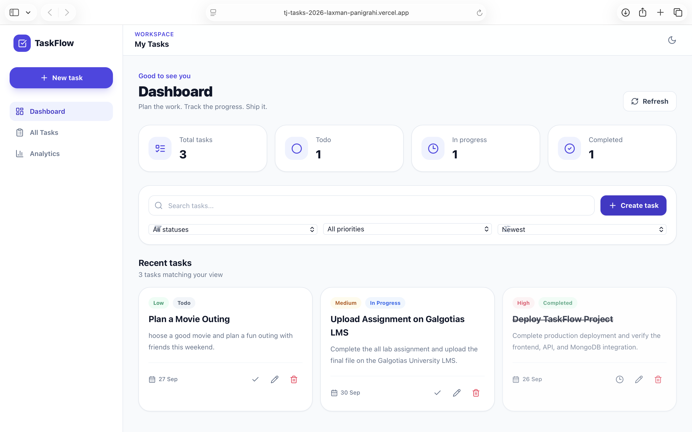
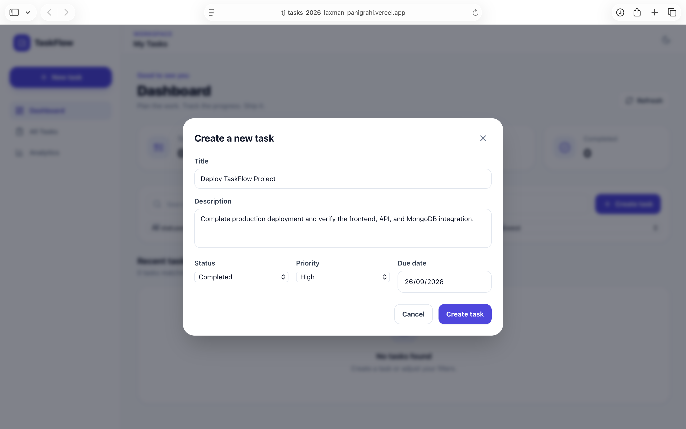
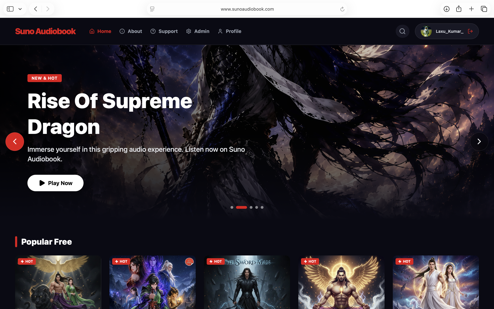
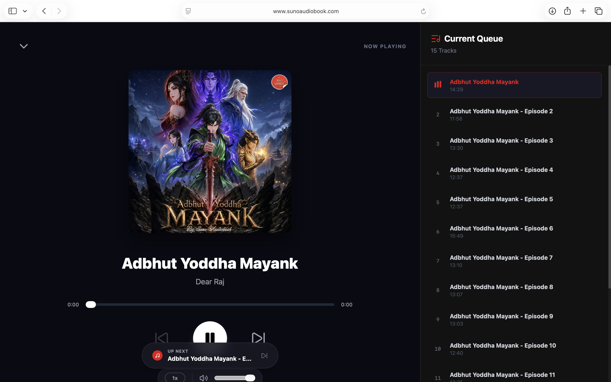

# TaskFlow — Modern Full-Stack Task Management

A polished SaaS-style task management application built for the **TechnoJam Web Development Technical Audition 2026**. TaskFlow provides a responsive dashboard for creating, tracking, searching, filtering, sorting, editing, completing, and deleting tasks with persistent MongoDB storage.

> **Repository:** `TJ-Tasks-2026-Laxman_Panigrahi`

<p align="center">
  <a href="https://tj-tasks-2026-laxman-panigrahi.vercel.app">
    
  </a>
  <a href="https://github.com/laxucoder/TJ-Tasks-2026-Laxman_Panigrahi">
    
  </a>
</p>

<p align="center">
  
  
  
  
  
  
  
  
  
</p>

---

## ✨ Project Preview

TaskFlow combines a clean dashboard, dynamic statistics, task cards, responsive navigation, dark mode, and a REST API backed by MongoDB.

### 📊 Dashboard

<p align="center">

[](https://tj-tasks-2026-laxman-panigrahi.vercel.app)

</p>

### ➕ Create Task

<p align="center">

[](https://tj-tasks-2026-laxman-panigrahi.vercel.app)

</p>

---

## 🚀 Features

- 📊 Dynamic dashboard statistics
- ➕ Create tasks with validation
- ✏️ Edit existing tasks
- 🗑️ Delete tasks with confirmation
- ✅ Mark tasks completed
- 🔎 Search by title/description
- 🎯 Filter by status and priority
- ↕️ Sort by due date, priority, title, or newest
- 📅 Due dates and overdue indicators
- 🌙 Light/Dark mode
- 🔔 Toast notifications
- ⏳ Loading, error, and empty states
- 📱 Responsive desktop/tablet/mobile UI
- 🔌 REST API with Express + MongoDB
- 🛡️ Environment-based configuration and CORS

---

## 🧰 Tech Stack

| Layer | Technology |
|---|---|
| Frontend | React, Vite, Tailwind CSS |
| Backend | Node.js, Express.js |
| Database | MongoDB, Mongoose |
| API | REST |
| Deployment | Vercel, Render |
| Tooling | Git, GitHub, npm |

---

## 🏗️ Architecture

```text
Browser
  │
  ▼
React + Vite + Tailwind
  │
  │ API service (fetch)
  ▼
Express REST API
  │
  ├── Routes
  ├── Controllers
  ├── Validation / Error middleware
  ▼
Mongoose
  │
  ▼
MongoDB

## 📁 Project Structure

```text
TJ-Tasks-2026-Laxman_Panigrahi/
├── frontend/
│   ├── src/
│   │   ├── components/
│   │   │   ├── AppShell.jsx
│   │   │   ├── Modal.jsx
│   │   │   ├── StatCard.jsx
│   │   │   ├── TaskCard.jsx
│   │   │   ├── TaskForm.jsx
│   │   │   ├── TaskToolbar.jsx
│   │   │   └── Toast.jsx
│   │   ├── pages/
│   │   │   └── Dashboard.jsx
│   │   ├── services/
│   │   │   └── api.js
│   │   ├── App.jsx
│   │   ├── main.jsx
│   │   └── index.css
│   ├── .env.example
│   ├── index.html
│   ├── package.json
│   ├── postcss.config.js
│   ├── tailwind.config.js
│   └── vite.config.js
├── backend/
│   ├── controllers/taskController.js
│   ├── middleware/errorHandler.js
│   ├── models/Task.js
│   ├── routes/taskRoutes.js
│   ├── .env.example
│   ├── package.json
│   └── server.js
├── screenshots/
├── .gitignore
└── README.md
```

## 🚀 How It Works

1. The React dashboard requests tasks from `GET /api/tasks`.
2. Express routes the request to the task controller.
3. Mongoose reads/writes task documents in MongoDB.
4. The API returns JSON to the frontend.
5. React updates the dashboard, statistics, filters, and task list without a page refresh.

## ⚙️ Prerequisites

- Node.js 18+
- npm 9+
- A MongoDB database (local MongoDB or MongoDB Atlas)
- Git

## 🖥️ Frontend Setup

```bash
cd frontend
npm install
cp .env.example .env
npm run dev
```

The Vite app runs on the URL shown by Vite, normally `http://localhost:5173`.

## 🧩 Backend Setup

```bash
cd backend
npm install
cp .env.example .env
npm run dev
```

The API defaults to `http://localhost:5000`.

## 🍃 MongoDB Setup

### MongoDB Atlas

1. Create a MongoDB Atlas cluster.
2. Create a database user.
3. Add your development IP address to the Atlas network access list.
4. Copy the connection string.
5. Put it in `MONGODB_URI` in `backend/.env`.

### Local MongoDB

Use a local connection such as:

```env
MONGODB_URI=mongodb://127.0.0.1:27017/taskflow
```

## 🔐 Environment Variables

### Backend `.env`

```env
PORT=5000
MONGODB_URI=mongodb://127.0.0.1:27017/taskflow
CLIENT_URL=http://localhost:5173
NODE_ENV=development
```

### Frontend `.env`

```env
VITE_API_URL=http://localhost:5000/api
```

Never commit a real `.env` file, database password, API key, or secret.


## 🌐 Live Demo

Deployed

```text
https://tj-tasks-2026-laxman-panigrahi.vercel.app
```

## 🐙 GitHub Repository

```text
TJ-Tasks-2026-Laxman_Panigrahi
```

Push this folder to a GitHub repository with the exact name above.

## 🔮 Future Improvements

- Authentication and user accounts
- User-specific task ownership
- Drag-and-drop Kanban board
- Pagination for very large task collections
- Server-side search/filter/sort
- Automated API tests
- CI/CD with GitHub Actions
- Production deployment
- Activity history and audit logs

## 👨‍💻 Author

**Laxman Panigrahi**  
B.Tech CSE (Data Science)

Built as a full-stack web development technical audition project...


# 🎧 Suno Audiobook — My Own Full-Stack Audiobook Platform

<p align="center">
  
</p>

<h3 align="center">
  🎧 Listen. 📖 Imagine. ✨ Experience.
</h3>

<p align="center">
  A modern full-stack audiobook and storytelling platform built to deliver an immersive digital listening experience.
</p>

<p align="center">
  <a href="https://www.sunoaudiobook.com">🌐 Live Website</a>
  •
  <a href="https://github.com/laxucoder">💻 GitHub</a>
</p>

---

## 📖 About

**Suno Audiobook** is a modern audiobook and storytelling platform created to make digital storytelling more immersive, accessible, and enjoyable.

The platform allows users to explore audiobooks, listen to episodes through an integrated audio player, manage their accounts, and access premium content through a coin-based purchasing system.

I built Suno Audiobook as a real-world full-stack project to bring together **frontend development, backend engineering, authentication, audio streaming, payment integration, email services, user management, and production deployment** in one complete platform.

🚀 What started as an idea became a complete web product focused on delivering a smooth and engaging audiobook experience.

---

## ✨ Features

### 🎧 Audiobook Experience

- 📚 Browse available audiobooks and stories
- 🎵 Built-in audiobook player
- ⏭️ Episode navigation
- 📋 Current playback queue
- ▶️ Play, pause and resume listening
- 🔊 Audio volume controls
- ⚡ Smooth listening experience

### 🔐 Authentication

- 👤 User registration and login
- 🔒 Secure authentication
- 📧 Email-based account services
- 🔑 Password recovery
- 👤 User profile management

### 💎 Premium Content

- 🔐 Premium audiobook episodes
- 🪙 Coin-based content unlocking
- 💰 Multiple coin packages
- 📅 Content access period management
- ⚡ Instant premium access after successful purchase

### 💳 Payments

- 💳 Online payment integration
- 🪙 Coin purchasing system
- 🧾 Transaction-based access
- 🔐 Secure payment workflow

### 📧 Email Services

- 📩 Automated email communication
- 🔐 Authentication-related emails
- 📬 User notifications
- ⚡ Transaction-related communication

### 📊 Platform Management

- ⚙️ Admin functionality
- 📚 Audiobook/content management
- 👥 User management
- 📈 Platform monitoring and analytics

### 📱 User Experience

- 🌙 Modern dark interface
- 📱 Responsive design
- ⚡ Fast navigation
- 🎨 Clean and immersive UI
- 🖥️ Desktop-friendly experience
- 📲 Mobile-friendly interface

---

# 📸 Project Preview

## 🏠 Homepage

The homepage provides users with a cinematic introduction to the platform, featured stories, popular content, and quick access to audiobooks.

<p align="center">
  
</p>

---

## 🔐 Login

Users can securely access their accounts through the authentication system.

<p align="center">
  
</p>

---

## 🎧 Audiobook Player

The audiobook player provides an immersive listening experience with episode navigation and a current playback queue.

<p align="center">
  
</p>

---

## 💳 Premium Content & Coin System

Premium stories can be unlocked using the platform's coin system.

Users can purchase different coin packages and use their balance to access premium audiobook content.

<p align="center">
  
</p>

---

# 🛠️ Technology Stack

### Frontend


### Backend


### Database


### Services & Infrastructure


### Development


---

# 🏗️ Platform Architecture

Suno Audiobook follows a full-stack architecture where the frontend communicates with the backend through APIs.

```text
                    ┌─────────────────────┐
                    │      User 👤        │
                    └──────────┬──────────┘
                               │
                               ▼
                    ┌─────────────────────┐
                    │   React Frontend    │
                    │      🎨 UI/UX       │
                    └──────────┬──────────┘
                               │
                         REST APIs
                               │
                               ▼
                    ┌─────────────────────┐
                    │   Node.js +         │
                    │   Express Backend   │
                    └──────────┬──────────┘
                               │
              ┌────────────────┼────────────────┐
              │                │                │
              ▼                ▼                ▼
        ┌───────────┐   ┌────────────┐   ┌────────────┐
        │ Database  │   │ Payments   │   │   Email    │
        │    🗄️     │   │    💳      │   │    📧      │
        └───────────┘   └────────────┘   └────────────┘
                               │
                               ▼
                       Premium Content
                              🎧
